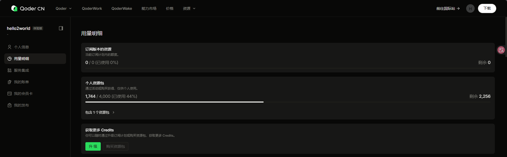

# CupLens：有时间证据的世界杯预测 Agent

> 答案会变化，证据不会。
> CupLens 将真实赛果、模型预测与大模型解释严格分层，为每一次世界杯冠军预测保留可复查、可比较、不可覆盖的时间快照。

## 🌐 在线演示

### [点击访问 CupLens 公网应用：http://47.108.64.133/](http://47.108.64.133/)

- **比赛项目**：[Qoder 码力星期四 · 世界杯挑战赛](https://tianchi.aliyun.com/competition/entrance/532498)
- **项目仓库**：[github.com/helloe365/CupLens](https://github.com/helloe365/CupLens)
- **当前快照**：`20260716-post-england-argentina-combined-v1`
- **当前模型**：`elo-poisson-dixon-coles-lightgbm-meta-enabled`
- **健康检查**：[http://47.108.64.133/api/health](http://47.108.64.133/api/health)

## 核心截图

### 1. 使用 Qoder 制定世界杯预测 Agent 方案


### 2. 使用 Qoder 分阶段执行并验证方案


### 3. 使用 Qoder 审查赛前快照合理性


## 项目亮点

| 优点                       | CupLens 的实现                                                                                            |
| -------------------------- | --------------------------------------------------------------------------------------------------------- |
| **预测有时间证据**   | 每次正式预测保存为包含数据截止时间、模型版本、来源、随机种子和 SHA-256 的 JSON 快照。快照只新增、不覆盖。 |
| **事实与预测不混写** | 已结束比赛固定标记为`actual`，未赛比赛固定标记为 `forecast`，前端使用不同视觉状态展示。               |
| **大模型不编造概率** | Elo、Poisson、Dixon–Coles 和蒙特卡洛负责数值计算；Qwen 只能调用四个白名单只读工具并解释返回结果。        |
| **概率变化可解释**   | 用户可以选择任意两个快照，查看球队夺冠概率变化以及期间新增的真实赛果。                                    |
| **可复算、可回测**   | 使用严格的时间切分，保证所有特征满足`feature_cutoff < match_date`；固定输入、参数和种子可复现相同结果。 |
| **失败仍可使用**     | Qwen Key 缺失或请求失败时自动切换到确定性模板，预测、赛程、快照比较和结构化结果仍然可用。                 |
| **部署轻量**         | React 前端与 FastAPI 后端构建为单个 Docker 镜像，运行时只读取预计算快照，不在线训练模型。                 |

传统预测应用经常把已经发生的比分、尚未发生的预测和 LLM 生成的解释混在一起。CupLens 的重点不是“让大模型猜冠军”，而是回答：

> 这个概率是在什么时间、基于哪些数据、由哪个模型生成的？真实赛果到来后，它为什么发生变化？

## 当前预测

最新快照生成于两场半决赛结束后，已锁定 30 场真实淘汰赛结果，并对剩余 2 场比赛进行预测。

| 球队      | 夺冠概率 |
| --------- | -------: |
| Argentina |  54.855% |
| Spain     |  45.145% |

以上数值直接读取自不可覆盖快照，不由 README 或 Qwen 重新计算。预测仅用于技术演示，不构成博彩建议。

## 三个 Web 视图

### 01 · 当前预测

- 展示最新快照、数据截止时间和模型版本；
- 展示夺冠概率与最可能进入决赛的球队；
- 展示 90 分钟胜/平/负概率、晋级概率、预期进球和 Top-3 比分；
- 所有数字均读取自后端结构化快照。

### 02 · 赛程与变化

- 在同一淘汰赛树中区分 `ACTUAL · 真实赛果` 与 `FORECAST · 模型预测`；
- 使用显式比赛 ID 连接 32 强至决赛的赛程关系；
- 支持选择两个快照并比较夺冠概率变化；
- 不根据不完整信息反推或补全数据。

### 03 · Agent 问答

可以向 CupLens 提问：

- “谁最可能夺冠？”
- “某场比赛的预测是什么？”
- “比较最早与最新快照有什么变化？”
- “这个模型有哪些限制？”

Agent 会先调用确定性工具，再基于工具结果生成解释。结构化结果始终优先于聊天文本。

## Agent：让语言解释证据，不让语言改写数字

```text
用户问题
   │
   ▼
React Web UI ── POST /api/chat ──► FastAPI
                                      │
                                      ▼
                             Qwen Function Calling
                                      │
                                      ▼
                          四个白名单只读确定性工具
                                      │
                                      ▼
                              不可覆盖 JSON 快照
                                      │
                   ┌──────────────────┴──────────────────┐
                   ▼                                     ▼
             结构化数据卡片                         Qwen 文字解释
             （数值真源）
```

Agent 只允许调用以下工具：

| 工具                     | 功能                                   |
| ------------------------ | -------------------------------------- |
| `get_current_forecast` | 读取最新冠军概率、剩余赛程和来源信息   |
| `get_match_prediction` | 读取指定比赛在最新快照中的预测         |
| `compare_snapshots`    | 比较两个快照的概率变化与新增真实赛果   |
| `get_model_card`       | 读取算法、回测指标、数据来源和模型限制 |

系统提示词明确限制 Qwen：

- 只能引用工具返回的数值；
- 不得自行重算、修改或补全概率；
- 回答必须注明快照 ID、数据截止时间和模型版本；
- 必须区分真实赛果、模型预测和用户假设；
- 不索取或泄露 API Key，不提供博彩建议。

## 预测模型

CupLens 使用确定性预测流水线生成快照，大模型不参与概率计算。

### 1. 时间衰减 Elo

- 所有球队从 1500 分开始；
- 不同赛事使用不同重要性权重；
- 历史比赛影响按三年半衰期衰减；
- Elo 差异用于球队强弱估计和淘汰赛平局后的晋级近似。

### 2. Poisson 比分矩阵

- 使用球队截止预测时间前最近 20 场比赛；
- 进攻和防守强度向全局均值收缩，降低小样本波动；
- 枚举 0–7 球的比分矩阵；
- 输出 90 分钟胜/平/负、预期进球和最可能比分。

### 3. Dixon–Coles 低比分修正

对 `0–0`、`1–0`、`0–1` 和 `1–1` 等低比分结果进行相关性修正。参数只使用测试赛事之前的世界杯数据选择，避免未来数据泄漏。

### 4. LightGBM 元模型实验

项目实现了基于 Elo 差、基础概率、攻防强度、近期状态、中立场和休息天数等赛前特征的 LightGBM 三分类元模型。

时间切分验证最终为 LightGBM 选择了 `0.0` 融合权重，因此当前组合模型不会夸大不存在的增益，输出等同于 Dixon–Coles 结果。实验代码和结果仍被保留，便于复核模型选择过程。

### 5. 蒙特卡洛模拟

每个正式快照使用固定随机种子，对剩余赛程执行 20,000 次模拟，预计算球队晋级和夺冠概率。生产服务只读取结果，不在用户请求期间训练或重算。

## 时间切分回测

历史数据包含 49,509 场公开国家队比赛。2018 和 2022 世界杯分别作为严格的时间外测试集，测试赛事本身不会进入对应特征。

| 测试年份 | 比赛数 | Accuracy | Brier Score | Log Loss |
| -------- | -----: | -------: | ----------: | -------: |
| 2018     |     64 | 0.578125 |    0.590071 | 0.988389 |
| 2022     |     64 | 0.437500 |    0.613694 | 1.031319 |

这些指标是未经校准的时间切分基线，用于记录模型表现和约束实验，不用于宣称模型优于其他方案。完整方法见 [模型卡](docs/model-card.md)。

## 可信快照

每份快照至少记录：

```json
{
  "snapshot_id": "20260716-post-england-argentina-combined-v1",
  "generated_at": "2026-07-16T16:40:44.445426+08:00",
  "cutoff_at": "2026-07-16T06:30:00+08:00",
  "model_version": "elo-poisson-dixon-coles-lightgbm-meta-enabled",
  "data_sha256": "6f8d012f0032f8b09a93e33fc3535a5234f5a5bf87eafe96b1a2d90eae137f69",
  "random_seed": 20260716,
  "iterations": 20000,
  "actual_matches": [],
  "forecast_matches": [],
  "team_probabilities": [],
  "sources": []
}
```

快照遵守以下规则：

1. 文件名与 `snapshot_id` 一致；
2. 已存在的快照 ID 禁止覆盖；
3. 已结束比赛只能进入 `actual_matches`；
4. 未赛比赛只能进入 `forecast_matches`；
5. 所有特征的截止时间必须早于被预测比赛；
6. 来源缺失、冲突或未核验时停止生成正式快照；
7. 相同输入、参数和随机种子必须产生相同结果。

当前仓库保留四个时间证据点：

```text
20260714-pre-semifinals-v1
        │
        ▼
20260715-post-france-spain-v1
        │
        ▼
20260716-post-england-argentina-v1
        │
        ▼
20260716-post-england-argentina-combined-v1
```

## 系统架构

```text
官方来源 + 独立来源 + 历史国家队比赛
                    │
                    ▼
            数据校验与时间截止检查
                    │
                    ▼
   Elo + Poisson + Dixon–Coles + 模型实验
                    │
                    ▼
         20,000 次剩余赛程蒙特卡洛
                    │
                    ▼
           不可覆盖、带哈希 JSON 快照
                    │
        ┌───────────┴───────────┐
        ▼                       ▼
 FastAPI 只读 API          四个 Agent 工具
        │                       │
        └───────────┬───────────┘
                    ▼
            React / Vite Web UI
                    │
                    ▼
          Docker + 公网反向代理
```

### 技术栈

| 层级 | 技术                                                                |
| ---- | ------------------------------------------------------------------- |
| 前端 | React 19、TypeScript、Vite、Recharts                                |
| 后端 | Python 3.11、FastAPI、Pydantic、Uvicorn                             |
| 模型 | NumPy、pandas、SciPy、scikit-learn、LightGBM                        |
| LLM  | 阿里云百炼 / DashScope OpenAI-compatible API、Qwen Function Calling |
| 数据 | 版本化 JSON、CSV、SHA-256                                           |
| 测试 | pytest、Vitest                                                      |
| 部署 | Docker、Docker Compose、Nginx、SSH 反向隧道                         |

### 目录结构

```text
CupLens/
├── backend/
│   ├── app/                  # FastAPI、预测模型、快照服务、Agent 与工具
│   └── tests/                # 后端单元测试与契约测试
├── frontend/
│   └── src/                  # 三个 Web 视图与可视化组件
├── data/
│   ├── raw/                  # 历史比赛与赛事数据
│   ├── mappings/             # 球队名称映射
│   └── snapshots/            # 不可覆盖预测快照与索引
├── docs/
│   ├── qoder/                # Qoder 开发过程截图
│   └── model-card.md         # 模型方法、回测和限制
├── scripts/                  # 数据校验、回测与快照更新入口
├── Dockerfile
├── docker-compose.yml
└── README.md
```

## 使用 Docker 运行

### 环境要求

- Docker Engine 或 Docker Desktop；
- Docker Compose 插件；
- 本地端口 `18080` 可用；
- DashScope API Key 可选。

### 启动

```bash
git clone https://github.com/helloe365/CupLens.git
cd CupLens

cp .env.example .env
docker compose up -d --build
docker compose ps
curl --fail http://127.0.0.1:18080/api/health
```

浏览器访问：

```text
http://127.0.0.1:18080/
```

如果需要启用 Qwen，在不会提交到 Git 的 `.env` 中配置：

```dotenv
DASHSCOPE_API_KEY=your_dashscope_api_key
```

不配置 Key 时，应用会自动使用模板回答，所有预测和结构化功能仍可使用。

停止服务：

```bash
docker compose down
```

## 开发验证

```bash
python scripts/validate_data.py

cd backend
python -m pytest -q

cd ../frontend
npm test -- --run
npm run build
```

## API

| 方法     | 路径                                           | 说明                      |
| -------- | ---------------------------------------------- | ------------------------- |
| `GET`  | `/api/health`                                | 服务健康状态与最新快照 ID |
| `GET`  | `/api/snapshots`                             | 快照索引                  |
| `GET`  | `/api/snapshots/latest`                      | 最新完整快照              |
| `GET`  | `/api/snapshots/{snapshot_id}`               | 指定快照                  |
| `GET`  | `/api/snapshots/compare?base=...&target=...` | 比较两个快照              |
| `GET`  | `/api/matches/{match_id}/prediction`         | 指定比赛预测              |
| `POST` | `/api/chat`                                  | Agent 工具问答            |

## Qoder 协作过程

CupLens 使用 Qoder 完成了从赛题分析、架构规划、任务拆分、测试驱动实现到赛前快照审查的完整开发流程。

<details>
<summary><strong>展开查看更多 Qoder 开发证据</strong></summary>

### 开始执行方案：工程骨架与健康接口


### 开始执行方案：数据契约与前置闸门


### 开始执行方案：模型实现与环境处理


### Qoder 额度使用记录



</details>

## 已知限制

- 预测不包含实时首发、球员伤病、停赛、天气、旅行和新闻特征；
- 加时赛与点球大战使用 Elo 概率近似，不是完整的加时和点球模型；
- 历史数据不能始终区分 90 分钟比分与加时赛后比分；
- LightGBM 实验没有在现有时间切分验证中获得正融合权重；
- 公网演示为比赛评审期临时服务；
- 所有预测均具有不确定性，不应作为博彩或财务决策依据。

## 设计原则

```text
事实不是预测。
预测不是解释。
解释不能改写事实或预测。
```

CupLens 希望展示的不只是一个冠军概率，而是一条从数据来源、时间截止、确定性计算到语言解释都可以被追溯的证据链。

## 相关链接

- [天池比赛页面](https://tianchi.aliyun.com/competition/entrance/532498)
- [Qoder 码力星期四 · 世界杯挑战赛技术报告：Fifa-Agent](https://tianchi.aliyun.com/forum/post/1065411)
- [参考项目：pangwenfeng/fifa](https://github.com/pangwenfeng/fifa)
- [CupLens 模型卡](docs/model-card.md)
- [CupLens 部署文档](docs/deployment.md)
