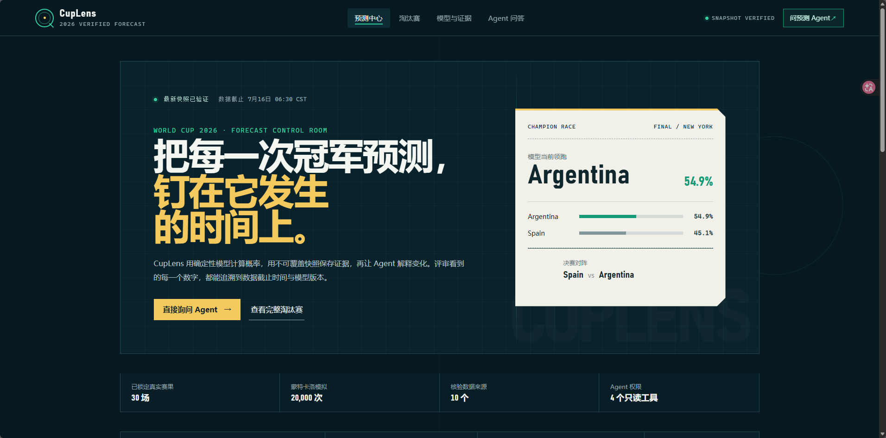
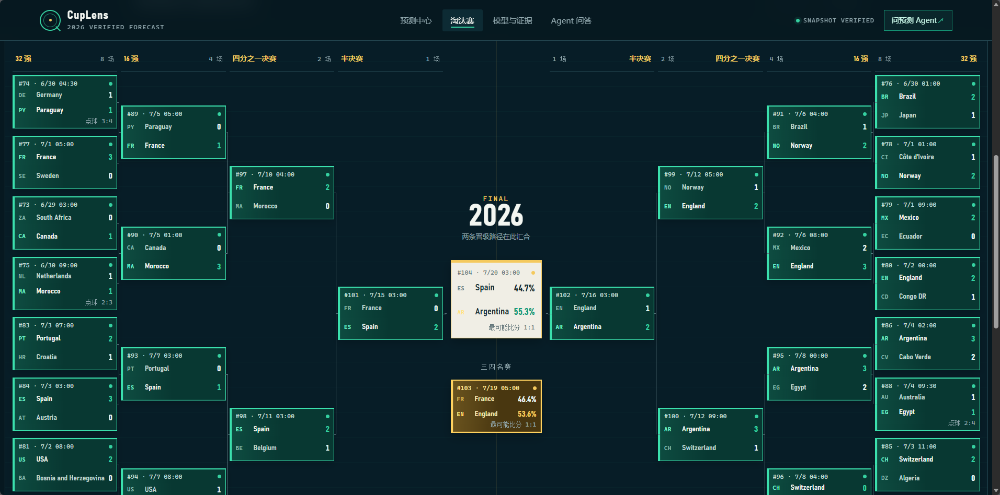
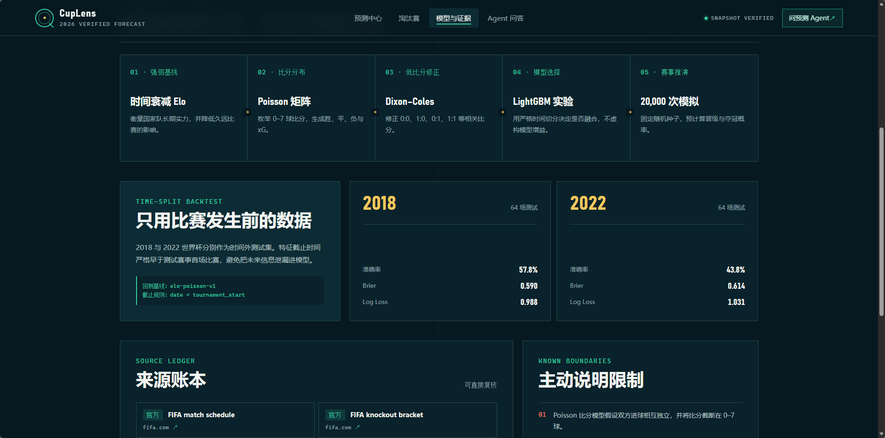
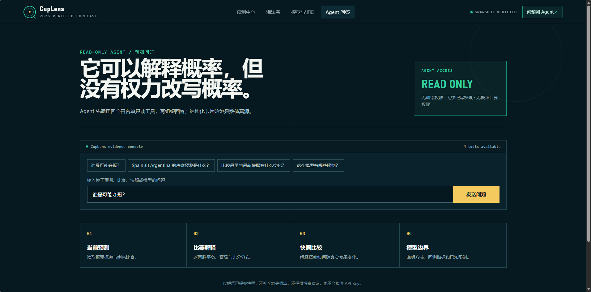
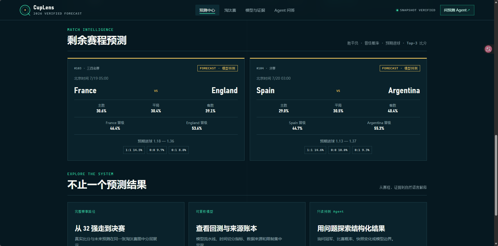
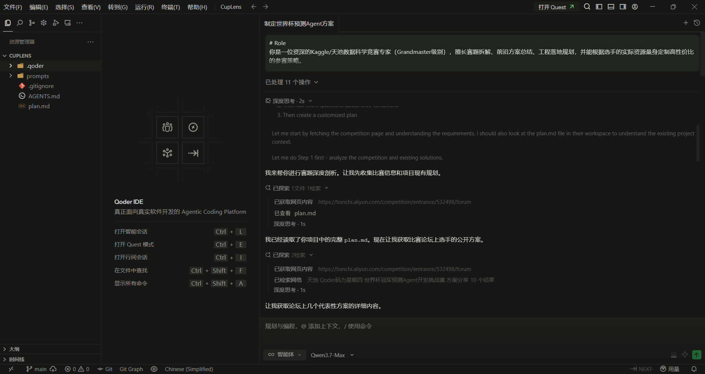
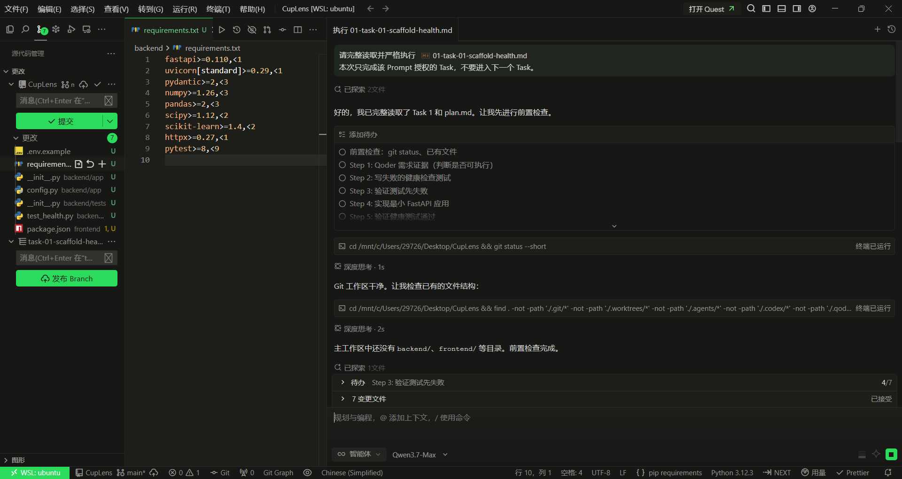
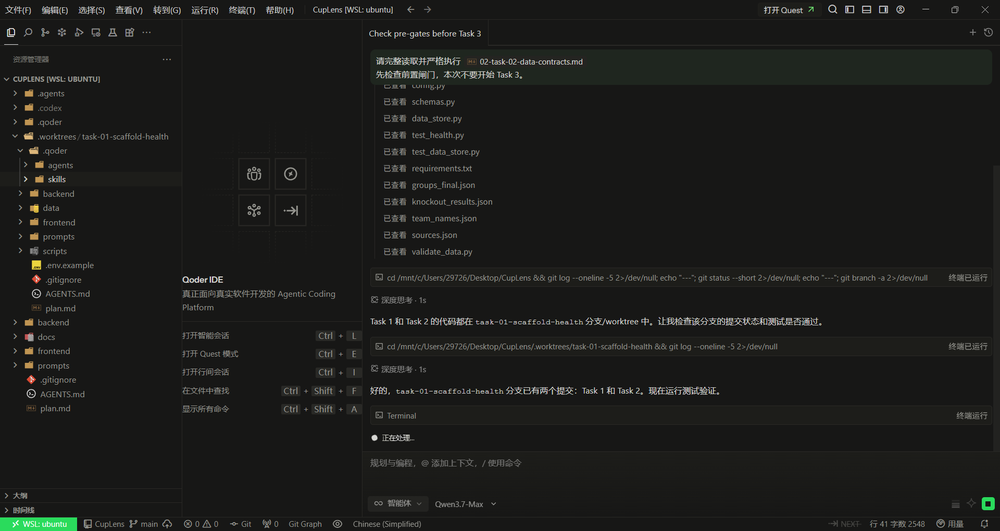
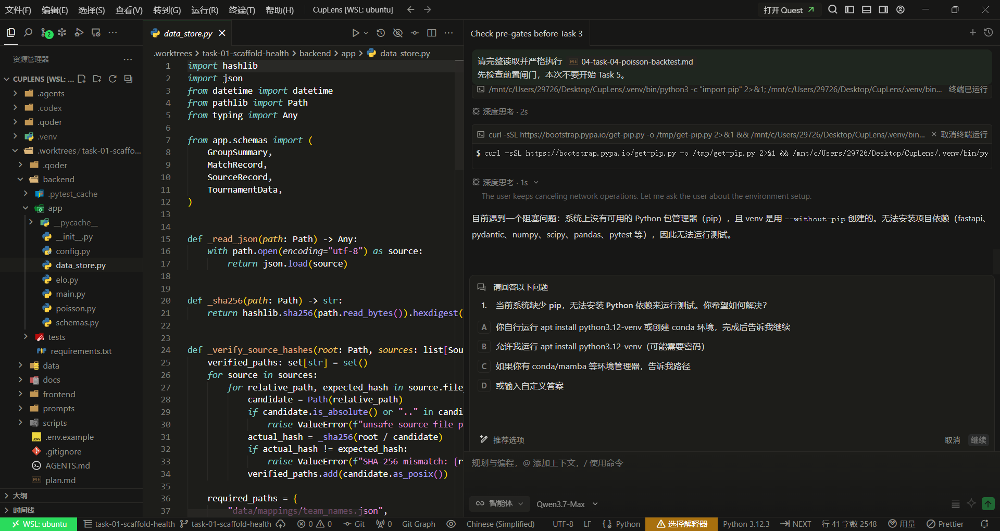
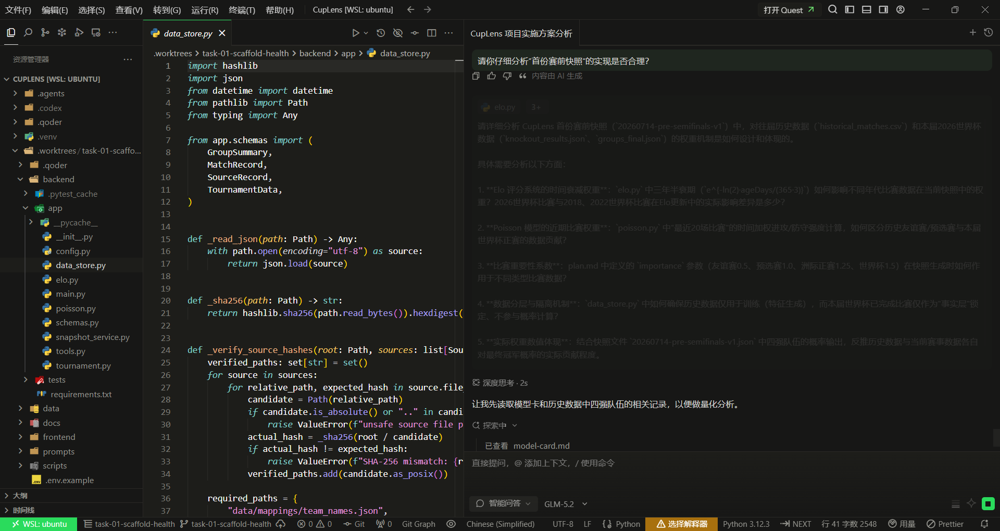

# CupLens：有时间证据的世界杯预测 Agent

> **答案会变化，证据不会。**<br>
> CupLens 用确定性模型计算概率，用不可覆盖快照保存证据，再让只读 Agent 解释结果。真实赛果、模型预测与大模型回答始终分层。

## 🌐 公网演示

### [立即体验 CupLens：http://47.108.64.133/](http://47.108.64.133/)

| 入口 | 地址 |
| --- | --- |
| Web 应用 | [http://47.108.64.133/](http://47.108.64.133/) |
| 健康检查 | [http://47.108.64.133/api/health](http://47.108.64.133/api/health) |
| 比赛页面 | [Qoder 码力星期四 · 世界杯挑战赛](https://tianchi.aliyun.com/competition/entrance/532498) |
| GitHub | [github.com/helloe365/CupLens](https://github.com/helloe365/CupLens) |

当前演示读取快照 `20260716-post-england-argentina-combined-v1`：已锁定 **30 场真实淘汰赛结果**，对剩余 **2 场比赛**执行 **20,000 次固定种子模拟**，并保留 **10 个核验来源**。

## 项目亮点

| 优点 | CupLens 的实现 |
| --- | --- |
| **每个概率都有时间证据** | 快照记录数据截止时间、生成时间、模型版本、来源、随机种子和 SHA-256；评委可以追溯数字在何时、基于什么生成。 |
| **真实赛果与预测醒目分层** | 已结束比赛固定进入 `actual_matches`，未赛比赛固定进入 `forecast_matches`；完整淘汰赛树使用不同颜色和标签展示。 |
| **Agent 不负责“猜概率”** | Elo、Poisson、Dixon–Coles 与蒙特卡洛负责数值计算；Qwen 只能调用 4 个白名单只读工具解释已有结构化结果。 |
| **预测变化可以复盘** | 支持任意两个快照对比，展示夺冠概率变化及期间新增的真实赛果，而不是用最新结果覆盖旧答案。 |
| **严格时间切分，避免泄漏** | 2018、2022 回测只使用对应世界杯开始前的数据，所有特征满足 `feature_cutoff < match_date`。 |
| **不夸大模型增益** | LightGBM 验证阶段选择的融合权重为 `0.0`；项目如实保留实验结论，不把无增益包装成提升。 |
| **没有大模型也能使用** | DashScope Key 缺失、超时或调用失败时自动返回确定性模板；预测、赛程、快照比较和结构化卡片不受影响。 |
| **低成本即可部署** | React 与 FastAPI 构建为单个 Docker 镜像；线上只读预计算快照，不进行在线训练，适合资源有限的比赛演示环境。 |

CupLens 关注的不只是“谁会夺冠”，而是回答三个更重要的问题：

1. 这个概率是在什么时间生成的？
2. 它使用了哪些数据、模型和来源？
3. 新的真实赛果到来后，概率为什么变化？

## 核心截图

### 预测中心：把冠军概率钉在生成它的时间上



### 完整淘汰赛：一张图同时展示真实路径与剩余预测



| 模型与证据 | 只读 Agent |
| --- | --- |
|  |  |

## Agent：解释概率，但没有权力改写概率

CupLens 采用 **tool-first** 流程。Agent 必须先调用确定性工具，结构化返回值是数值真源，语言模型只负责把证据组织成易读回答。

```text
用户问题
   │
   ▼
React Web UI ── POST /api/chat ──► FastAPI
                                      │
                                      ▼
                             Qwen Function Calling
                                      │
                                      ▼
                          4 个白名单只读确定性工具
                                      │
                                      ▼
                              不可覆盖 JSON 快照
                                      │
                   ┌──────────────────┴──────────────────┐
                   ▼                                     ▼
             结构化数据卡片                         语言解释
             （数值真源）                         （不重算概率）
```

### 四个只读工具

| 工具 | 能力 |
| --- | --- |
| `get_current_forecast` | 读取最新冠军概率、剩余比赛、来源和快照元数据。 |
| `get_match_prediction` | 读取指定比赛的胜/平/负、晋级概率、xG 和 Top-3 比分。 |
| `compare_snapshots` | 比较两个快照的概率变化与新增真实赛果。 |
| `get_model_card` | 读取算法、回测指标、数据来源和已知限制。 |

### 为什么 Agent 更可靠

- 工具名经过白名单校验，参数经过 Pydantic 类型校验；
- 每轮只接受一个合法工具调用，最多执行 4 轮；
- 回答必须注明快照 ID、数据截止时间与模型版本；
- 回答必须区分真实赛果、模型预测和用户假设；
- Agent 没有训练权限、快照写权限和概率计算权限；
- API Key 只存在后端环境变量中，不进入前端或回答；
- Qwen 不可用时自动降级，结构化能力仍然可用。

可以直接尝试：

- “谁最可能夺冠？”
- “Spain 和 Argentina 的决赛预测是什么？”
- “比较最早与最新快照有什么变化？”
- “这个模型有哪些限制？”

## 预测模型：概率由确定性流水线生成

大模型不参与概率计算。正式预测由以下流水线生成并写入快照：

| 阶段 | 方法 | 主要输出与优势 |
| --- | --- | --- |
| 01 · 强弱基线 | 时间衰减 Elo | 衡量长期国家队强弱；不同赛事使用不同权重，久远比赛按三年半衰期降低影响。 |
| 02 · 比分分布 | Poisson 8×8 矩阵 | 枚举 0–7 球比分，输出 90 分钟胜/平/负、预期进球和 Top-3 比分。 |
| 03 · 低比分修正 | Dixon–Coles | 修正 `0:0`、`1:0`、`0:1`、`1:1` 等低比分相关性。 |
| 04 · 模型选择 | LightGBM 元模型实验 | 使用赛前特征和严格时间验证选择融合权重；当前权重为 `0.0`，不虚构额外增益。 |
| 05 · 赛事推演 | 20,000 次蒙特卡洛 | 固定随机种子推演剩余赛程，预计算晋级和夺冠概率。 |



### 时间切分回测

项目使用 49,509 条公开国家队历史比赛记录。2018 和 2022 世界杯分别作为时间外测试集，不使用随机切分，也不会把测试赛事结果加入对应特征。下表是 `elo-poisson-v1` **回测基线**，不是当前组合模型的成绩。

| 测试年份 | 比赛数 | Accuracy | Brier Score | Log Loss |
| --- | ---: | ---: | ---: | ---: |
| 2018 | 64 | 0.578125 | 0.590071 | 0.988389 |
| 2022 | 64 | 0.437500 | 0.613694 | 1.031319 |

当前快照模型版本为 `elo-poisson-dixon-coles-lightgbm-meta-enabled`。组合实验中 LightGBM 的验证融合权重为 `0.0`，因此当前组合输出等同于 Dixon–Coles 输出。相对 Elo–Poisson 基线，Dixon–Coles 的 pooled Brier 与 Log Loss 分别改善约 `0.191%` 和 `0.185%`，未达到原定 `1%` 激活门槛；项目保留这一真实结论，不宣称模型优于其他方案。

更完整的方法、公式、实验结果和边界见 [模型卡](docs/model-card.md)。

## 可信快照：旧预测只新增，不覆盖

每份正式快照都同时保存预测结果与生成依据：

| 字段 | 当前快照示例 |
| --- | --- |
| `snapshot_id` | `20260716-post-england-argentina-combined-v1` |
| `generated_at` | `2026-07-16T16:40:44.445426+08:00` |
| `cutoff_at` | `2026-07-16T06:30:00+08:00` |
| `model_version` | `elo-poisson-dixon-coles-lightgbm-meta-enabled` |
| `data_sha256` | `6f8d012f0032f8b09a93e33fc3535a5234f5a5bf87eafe96b1a2d90eae137f69` |
| `random_seed` | `20260716` |
| `iterations` | `20000` |
| 结果内容 | 30 场 `actual`、2 场 `forecast`、球队晋级与夺冠概率、来源和限制 |

### 写入器保证的不可覆盖规则

这里的“不可覆盖”指项目写入器执行 append-only、同 ID 拒绝覆盖；它不是对操作系统文件权限或 Git 历史不可修改的夸大承诺。

1. 文件名必须与 `snapshot_id` 一致；
2. 已存在的快照 ID 使用独占原子写入，重复写入直接失败；
3. 已结束比赛只能进入 `actual_matches`；
4. 未赛比赛只能进入 `forecast_matches`；
5. 特征截止时间必须早于被预测比赛；
6. 正式快照必须保留来源和数据 SHA-256；
7. 相同输入、参数和种子必须得到相同结果。

仓库当前保留四个时间证据点：

```text
20260714-pre-semifinals-v1
        │
        ▼
20260715-post-france-spain-v1
        │
        ▼
20260716-post-england-argentina-v1
        │
        ▼
20260716-post-england-argentina-combined-v1
```

前端可以选择任意两个快照，直接查看球队夺冠概率变化与新增真实赛果。旧预测因此不会被赛后信息悄悄改写。

## 系统架构

```text
官方赛程 / 赛果 + 独立核验来源 + 历史国家队比赛
                         │
                         ▼
                数据契约与时间截止校验
                         │
                         ▼
       Elo + Poisson + Dixon–Coles + LightGBM 实验
                         │
                         ▼
              20,000 次剩余赛程模拟
                         │
                         ▼
            不可覆盖、带哈希 JSON 快照
                         │
             ┌───────────┴───────────┐
             ▼                       ▼
      FastAPI 只读 API          4 个 Agent 工具
             │                       │
             └───────────┬───────────┘
                         ▼
                 React / Vite Web UI
                         │
                         ▼
             单 Docker 镜像 / Uvicorn
                         │
                         ▼
       WSL 127.0.0.1:18080 ── SSH 反向隧道 ──► 云服务器 Nginx :80
```

### 技术栈

| 层级 | 技术 |
| --- | --- |
| 前端 | React 19、TypeScript、Vite、Recharts |
| 后端 | Python 3.11、FastAPI、Pydantic、Uvicorn |
| 模型 | NumPy、pandas、SciPy、scikit-learn、LightGBM |
| Agent | 阿里云百炼 / DashScope OpenAI-compatible API、Qwen Function Calling |
| 数据 | 版本化 JSON、CSV、SHA-256 |
| 测试 | pytest、Vitest |
| 部署 | Docker、Docker Compose、Nginx、SSH 反向隧道 |

### 主要 API

| 方法 | 路径 | 说明 |
| --- | --- | --- |
| `GET` | `/api/health` | 服务状态和最新快照 ID |
| `GET` | `/api/snapshots` | 快照索引 |
| `GET` | `/api/snapshots/latest` | 最新完整快照 |
| `GET` | `/api/snapshots/{snapshot_id}` | 指定快照 |
| `GET` | `/api/snapshots/compare?base=...&target=...` | 两个快照的确定性差异 |
| `GET` | `/api/matches/{match_id}/prediction` | 指定比赛预测 |
| `POST` | `/api/chat` | Agent 工具问答 |

## 使用 Docker 运行

### 环境要求

- Docker Engine 或 Docker Desktop；
- Docker Compose 插件；
- 本地端口 `18080` 可用；
- DashScope API Key 可选。

### 启动应用

```bash
git clone https://github.com/helloe365/CupLens.git
cd CupLens
cp .env.example .env
docker compose up -d --build
docker compose ps
curl --fail http://127.0.0.1:18080/api/health
```

浏览器访问：

```text
http://127.0.0.1:18080/
```

Compose 使用多阶段构建：Node 20 编译 React，Python 3.11 镜像运行 FastAPI，并由同一个 Uvicorn 服务提供 API 和 SPA。运行期只读取已提交快照，不在线训练模型。

### 可选启用 Qwen

在不会提交到 Git 的 `.env` 中设置：

```dotenv
DASHSCOPE_API_KEY=your_dashscope_api_key
```

不配置 Key 时应用自动使用模板回答，预测、淘汰赛、模型证据和快照比较仍可使用。

### 常用运维命令

```bash
# 修改前端或后端后重新构建
docker compose up -d --build

# 查看容器状态与日志
docker compose ps
docker compose logs --tail=100 cuplens

# 停止服务
docker compose down
```

当前公网演示使用云服务器作为轻量入口，计算仍在本地 WSL：

```text
评委浏览器 → 47.108.64.133:80 → Nginx
                                  → SSH 反向隧道
                                  → WSL 127.0.0.1:18080
                                  → CupLens Docker :8000
```

完整的 WSL、公网反向隧道和 Nginx 运维说明见 [部署文档](docs/deployment.md)。

## 已知限制

- 当前模型未纳入实时首发、球员伤病、停赛、天气、旅行、新闻和球员级数据；
- Poisson 比分模型仍基于简化的进球分布假设，并将比分矩阵截断在 0–7 球；
- 加时赛与点球大战使用 Elo 晋级概率近似，不是完整的加时和点球模型；
- 历史公开数据不能始终区分 90 分钟比分与加时赛后比分；
- Dixon–Coles 的回测改善低于原定 1% 门槛，LightGBM 的验证融合权重为 `0.0`，因此不宣称显著模型增益；
- 自动赛果更新默认关闭，正式快照仍要求人工核验来源、时间和状态转换；
- 公网演示是比赛评审期临时服务，依赖本地电脑、网络与 SSH 隧道持续在线；
- 所有概率都是不确定性估计，仅用于技术演示，不构成博彩或财务建议。

## Qoder 协作过程

Qoder 参与了赛题理解、方案设计、工程拆分、测试驱动实现与赛前快照审查。核心价值不是替代模型，而是帮助把预测任务拆成可验证的数据契约、模型流水线、快照证据与部署步骤。

<details>
<summary><strong>查看 Qoder 从方案设计到快照审查的完整过程</strong></summary>

### 01 · 制定世界杯预测 Agent 方案



### 02 · 搭建工程骨架与健康接口



### 03 · 建立数据契约与测试门禁



### 04 · 实现预测模型并处理环境依赖



### 05 · 审查赛前快照合理性



</details>

## 设计原则

```text
事实不是预测。
预测不是解释。
解释不能改写事实或预测。
```

CupLens 展示的不只是一个冠军概率，而是一条从数据来源、时间截止、确定性计算、不可覆盖快照到语言解释都可追溯的证据链。

## 相关链接

- [天池比赛页面](https://tianchi.aliyun.com/competition/entrance/532498)
- [Qoder 码力星期四 · 世界杯挑战赛技术报告：Fifa-Agent](https://tianchi.aliyun.com/forum/post/1065411)
- [参考项目：pangwenfeng/fifa](https://github.com/pangwenfeng/fifa)
- [CupLens 模型卡](docs/model-card.md)
- [CupLens 部署文档](docs/deployment.md)
